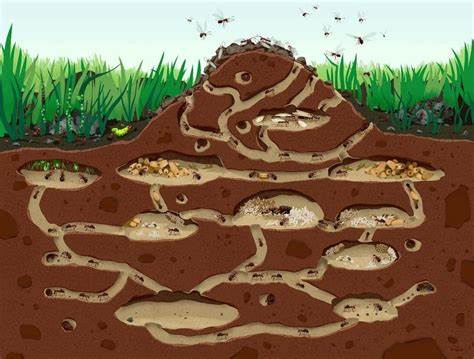

# Une vie de fourmi

Un trou, des tunnels et des salles

---

  Ce projet vise à explorer  des stratégies pour coordonner efficacement le mouvement des fourmis à travers la fourmilière, en tenant
  
 compte de la topologie du réseau de salles et des contraintes de déplacement.
 
 L'objectif principal est de déplacer toutes les fourmis du vestibule au dortoir en empruntant le plus court chemin .
 
--



## Exemple de graphe d'une fourmilière

Etapes de déplacement des fourmis au sein d'une fourmilière 


## Prerequisites
```
- pip install -r requirement.txt
- pip install networkX
- pip install matplotlib
```

## Note

 Il est possible d'ajouter le nombre de fourmillières avec la fonction **add_new_graph_from_text()**

 ## Authors

 - Julien
 - Amina
 - Tanjona

 

